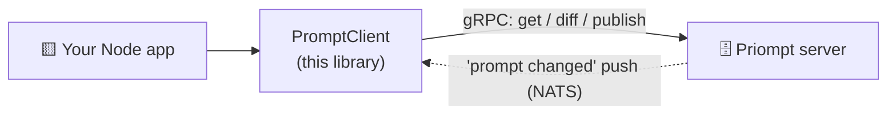

# Priompt JavaScript client

**The piece your Node app imports to fetch its prompts.** Instead of
hard-coding prompt text in your source, your app asks a
[Priompt](https://github.com/) server for it by address — and can be notified
the moment a prompt changes.



No codegen anywhere: the client loads `proto/priompt/v1/prompt.proto` at
runtime via `@grpc/proto-loader`.

## Install

```sh
npm i @grpc/grpc-js @grpc/proto-loader        # and `nats` only if you use subscribe()
```

## Five lines to your first prompt

```js
const { PromptClient } = require("priompt-client");

const client = new PromptClient({ host: "localhost:8443" }); // token: "..." if auth is on
const prompt = await client.get("priompt://acme/onboarding/welcome");

console.log(prompt.template);       // Hi {name}, welcome to {org}!
console.log(prompt.version_hash);   // 80ec4e4d…
```

What comes back from `get()`:

| Field | Example | Meaning |
| --- | --- | --- |
| `template` | `Hi {name}, welcome to {org}!` | The prompt text, with `{placeholders}` |
| `slots` | `['name', 'org']` | The blanks your app fills in |
| `version_hash` | `80ec4e4d…` | Fingerprint of this exact content |

## Connecting

One environment variable configures everything:
`PRIOMPT_URL=priompt://<token>@host:port` carries the address *and* the
credential, so `new PromptClient()` with no arguments just works.

```js
new PromptClient({ host, token, tls = false, natsUrl, natsToken, url })
```

| Option | What it does |
| --- | --- |
| `host` | `address:port` of the server. Optional if `url` or `PRIOMPT_URL` is set |
| `url` | a full `priompt://<token>@host:port` string; defaults to `PRIOMPT_URL` |
| `token` | sent as `authorization: Bearer <token>`; explicit value wins over the url's token |
| `tls` | use TLS to reach the server |
| `natsUrl` | broker endpoint for `subscribe()`; may carry the credential as `nats://<token>@host:4222` |
| `natsToken` | broker credential, if you would rather pass it separately; wins over the url's |

The broker has its own credential, separate from the gRPC token — change events
name every prompt that moves and carry the verdict agents act on, so the server
requires one whenever NATS is reachable off-loopback.

## Everything the client can do

```js
await client.get(uri, ref)                 // fetch (ref = branch/commit hash to pin a version)
await client.diff(uri, newTemplate)        // semantic diff: stored version vs. your draft
await client.publish(uri, template, slots) // publish a new version + notify subscribers
client.subscribe(uri, onChange)            // be notified the moment the prompt changes
```

## Live updates

When someone publishes a new version, the server pushes a notification that
includes a **semantic verdict** — how big the change really is. Auto-reload the
safe ones, hold the dangerous ones:

`subscribe()` needs `natsUrl` — it talks to the broker directly, not through the
gRPC endpoint — and the broker's own credential when one is configured.

```js
const client = new PromptClient({
  host: "localhost:8443",
  token: "…",                                   // gRPC bearer token
  natsUrl: "nats://<nats-token>@localhost:4222", // or natsToken: "<nats-token>"
});

client.subscribe("priompt://acme/support/agent", (version, classification) => {
  if (classification === "structural") {
    alertAHuman(version);     // the meaning changed shape — review it
  } else {
    reload(version);          // safe to pick up automatically
  }
});
```

Treat the event as a notification that *something* changed, and re-fetch with
`get()` over the authenticated gRPC channel rather than trusting the version and
classification in the payload.

## For maintainers of this library

`proto/priompt/v1/prompt.proto` is vendored from the shared **proto** repo
(the single source of truth) so the npm package stays self-contained. After
the contract changes, run `npm run sync-proto` to re-vendor it. There is no
generated code to rebuild (the proto is loaded at runtime).

Quick smoke test:

```sh
node --check client.js
node -e "new (require('./client.js').PromptClient)({host:'localhost:1'})"
```
